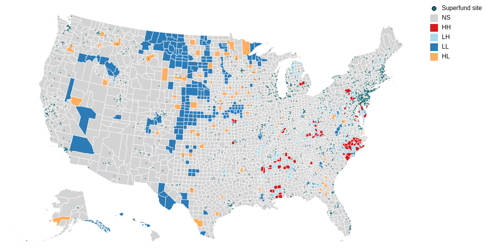
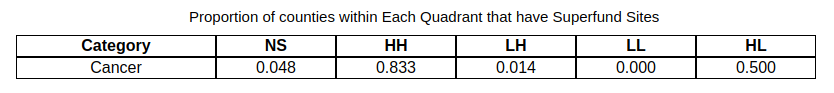

# Visualizing the Link between Superfund Sites and Medicare Treatment Data

## Intro

In 1980, the United States Congress passed the Superfund Act, which identifies and requires clean-up of hazardous waste sites across the country. The goal of this project was to find a link between these Superfund hazardous waste sites and health conditions by linking the location of these sites with hospital-level Medicare treatment data. [Census](https://www.kaggle.com/datasets/srrobert50/federal-superfunds?select=pdb_tract.csv) and [Superfund site](https://www.kaggle.com/datasets/srrobert50/federal-superfunds?select=priorities_list_full.json) data were downloaded from Kaggle. [Medicare](https://www.kaggle.com/datasets/cms/cms-medicare) data was queried using Google's BigQuery API.

A link to the working visualization can be found [here](https://lkreisel.github.io/superfund_medicare/d3/index.html)

## Data Preparation
The following steps were taken to prepare the data:

* A county-level Superfund density metric was calculated, which was the total number of Superfund sites in the county.
* The EPA assigns a hazardous ranking score (HRS) value between 0 and 100 to each Superfund site based on the potential hazard to humans or the environment. A county-level Total HRS was calculated, which was the sum of hazardous waste scores for every Superfund site in the county.
* The hospital data included the number of people who received every Medicare-sponsored treatment at every hospital in the country. These counts were adjusted by the population of the county that was 65 and older, as recorded by the 2013 American Community Survey
* The Medicare data set contains 563 unique treatments. Any treatment that related to acute injuries (e.g., burns,
concussions), acute illnesses (e.g., viral infection, parasitic disease, alcoholic hepatitis), or non-specific
procedures (e.g., "diagnostic ultrasound") were removed. The remaining treatments were  manually categorized into one of the following eleven systems of the body: musculoskeletal system, circulatory system, digestive and excretory system, endocrine system, exocrine system, nervous system, renal system, respiratory system, immune system, reproductive system, and treatment for cancers. Spatial autocorrelation values were calculated for each of these 11 treatment categories. 

## Spatial Autocorrelation

To visualize the relationship between treatment data and proximity to Superfund sites, we calculated Local Moran I spatial autocorrelation values. These values allow us to detect clusters of activity different from what would be expected under the assumption of spatial randomness. To calculate these values, we first calculated matrices of weights that contained the distances of every county to every other county. We then created vectors of treatment rates for each county. Finally, we calculated the correlation of the treatment rates in every county against every other county, multiplying by the spatial distance weights. The Python package PySal was used to generate a complete spatial randomness (CSR) distribution, which allows us to test whether the spatial auto-correlation values are bigger than what we would expect if the attributes were distributed normally across all counties. This process was repeated for each of the 11 treatment categories outlined above. This analysis allows us to identify statistically significant clusters of treatment rates and understand the direction of those relationships. 

We plotted the statistically significant spatial autocorrelation values along with the locations of Superfund sites on a county-level map of the United States. The dropdown menu in the visualization generates a spatial autocorrelation map for each of the eleven different treatment categories. Counties colored red have high-high spatial autocorrelation, meaning these counties have significantly higher treatment rates than what would be expected if treatment rates were randomly spatially distributed. Counties colored dark blue have low-low spatial autocorrelation, meaning these counties have significantly lower treatment rates than what would be expected. Counties colored orange indicate places where the given county has a high value but the average of the surrounding counties have lower values than what would be expected. Counties colored light blue indicate areas where the given county has a low treatment rate but the average of the surrounding counties have higher treatment rates than what would be expected. The image below shows the statistically significant spatial autocorrelation values for all treatment categories combined.

The spatial autocorrelation results identified some areas of interest. For example, for the "immune system" map, a cluster in Utah and another in Washington both contain several Superfund sites and that also have significantly higher treatment rates for immune system disorders than surrounding counties. The table below the map shows what proportion of spatially significant counties in each quadrant contained Superfund sites. You can see that, for cancer treatments, over 83% of statistically significant high-high clusters contained Superfund sites. 

## Further Analysis

Limitations of the project include the use of Medicare data, which only includes treatment for residents 65 and older. Next steps for analysis include disaggregating the type of hazardous waste at the Superfund sites and seeing if specific types of hazardous waste show links with specific health conditions. Further analysis could also including calculating spatial autocorrelation at Census tract level instead of the county level to pick up more localized effects. 

** Note: this was a group project

